# 🟡 PACMAN KEY HUNT — AI Edition

> Game Pacman với mê cung ngẫu nhiên và Ghost được điều khiển bằng **5 thuật toán AI** kết hợp **5 hành vi** khác nhau.
>
> **Môn học:** Nhập môn Trí tuệ nhân tạo — Đại học Bách Khoa Hà Nội

---

## 📑 Mục lục

1. [Luật chơi](#-luật-chơi)
2. [Cài đặt & chạy](#-cài-đặt--chạy)
3. [Thuật toán AI](#-thuật-toán-ai)
4. [Demo trực quan](#-demo-trực-quan)
5. [Đề xuất cấu hình Ghost](#-đề-xuất-cấu-hình-ghost)
6. [Cấu trúc dự án](#-cấu-trúc-dự-án)

---

## 🎮 Luật chơi

| | |
|:--|:--|
| 🕹️ **Điều khiển** | Phím mũi tên di chuyển Pacman |
| 🔑 **Mục tiêu** | Thu thập **3 chìa khóa** (Vàng / Xanh / Đỏ) |
| 🚪 **Chiến thắng** | Tới **EXIT** ở góc dưới-phải sau khi đủ chìa |
| 👻 **Thua** | Bị Ghost bắt |

**Tùy chỉnh:** kích thước map (8–28 × 6–18), số ghost (1–4), thuật toán + hành vi + tốc độ riêng cho từng ghost.

---

## ⚙️ Cài đặt & chạy

```bash
# 1. Clone
git clone https://github.com/Sper-il/Pacman-v2.git
cd Pacman-v2

# 2. Cài thư viện
pip install pygame matplotlib numpy

# 3. Chạy game
python src/main.py
```

**Tùy chọn khác:**

```bash
python generate_demos.py          # Tạo lại 21 GIF demo
jupyter notebook algorithm_comparison.ipynb   # Mở notebook phân tích
```

---

## 🧠 Thuật toán AI

### 🏗️ Tạo mê cung — `DFS`

**Randomized Depth-First Search** (Recursive Backtracking) tạo mê cung cơ sở, sau đó phá thêm **15% tường** để tạo nhiều đường đi thay thế.

### 🔍 Tìm đường — 4 thuật toán

| Thuật toán | Tối ưu | Tốc độ | Đặc điểm |
|:-----------|:------:|:------:|:---------|
| **BFS** | ✅ | ⭐⭐ | Duyệt theo chiều rộng — đường ngắn nhất |
| **A\*** | ✅ | ⭐⭐⭐⭐ | g(n) + h(n) — **hiệu quả nhất** |
| **GBFS** | ❌ | ⭐⭐⭐⭐⭐ | Chỉ h(n) — nhanh nhất nhưng đường có thể vòng |
| **Dijkstra** | ✅ | ⭐⭐ | Như BFS với priority queue |

### 👻 Hành vi Ghost — 5 kiểu

| Hành vi | Mục tiêu | Ghost gốc |
|:--------|:---------|:---------:|
| **Chase** | Vị trí Pacman | Blinky 🔴 |
| **Predict** | 2 ô trước hướng Pacman | Pinky 🩷 |
| **Flank** | 3 ô sau lưng Pacman | Inky 🩵 |
| **Patrol** | Tuần tra 4 góc theo vòng | Clyde 🟠 |
| **Random** | Ô bất kỳ | — |

> **Tổng:** 4 thuật toán × 5 hành vi = **20 tổ hợp AI** khác nhau.

---

## 🎬 Demo trực quan

Tất cả GIF dùng **cùng 1 mê cung** (seed cố định) để dễ so sánh.

### Mê cung được tạo bằng DFS

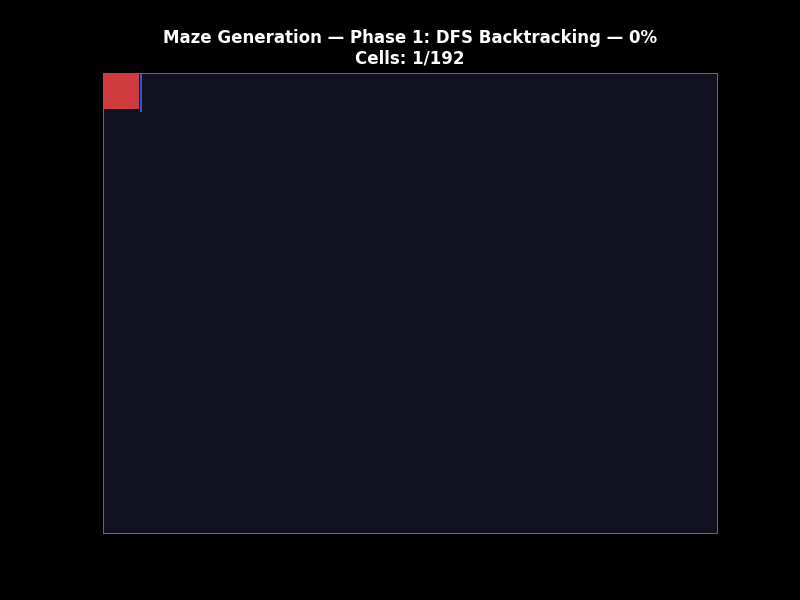

### So sánh 4 thuật toán × 5 hành vi

<details open>
<summary><b>🔵 BFS</b> — Đường ngắn nhất, ổn định</summary>

| Chase | Predict | Flank | Patrol | Random |
|:-----:|:-------:|:-----:|:------:|:------:|
| 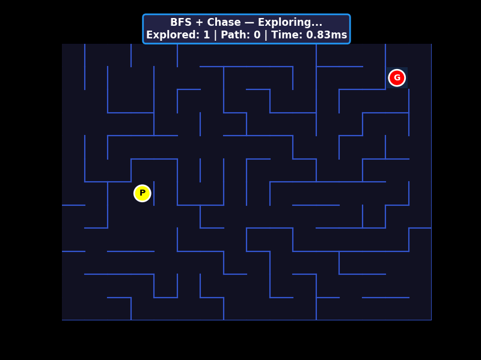 | 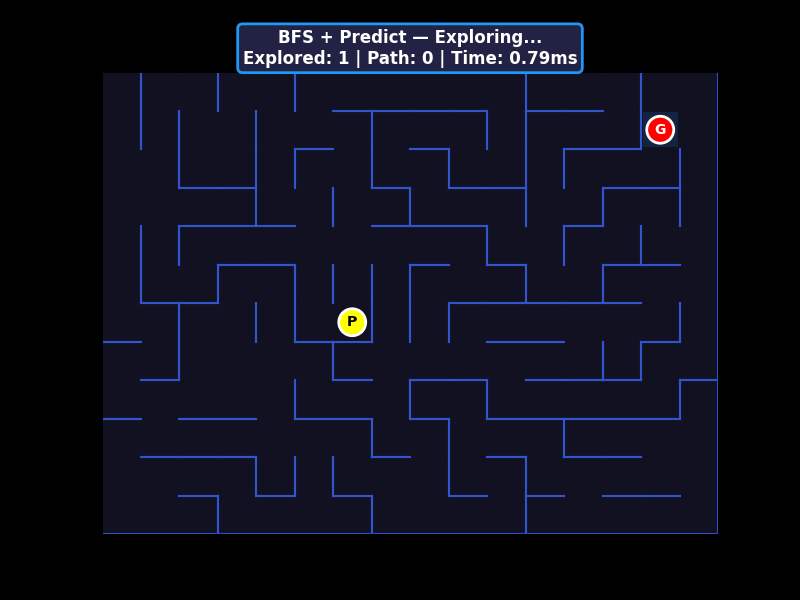 | 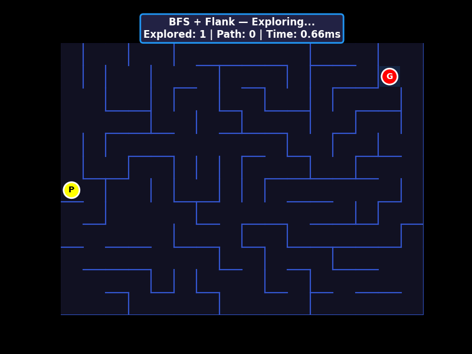 | 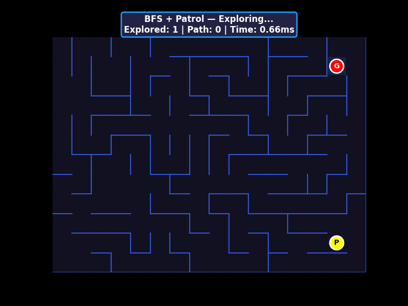 | 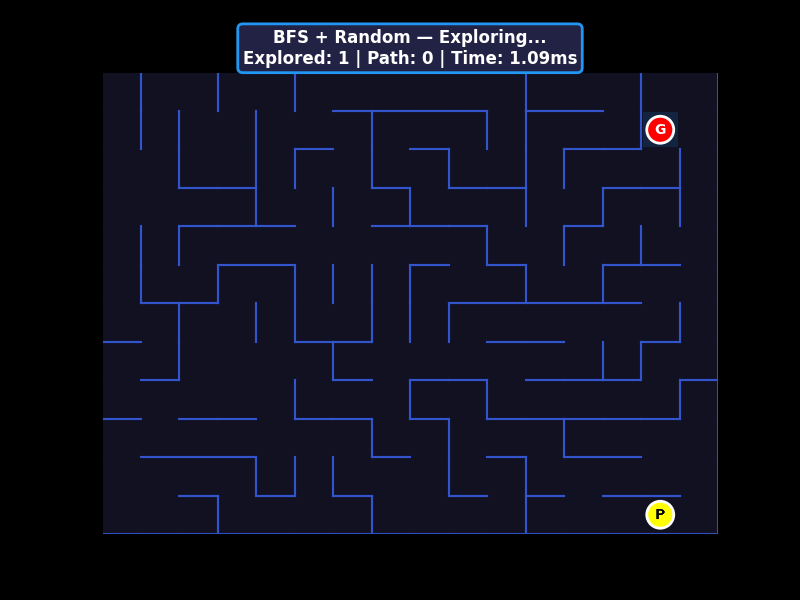 |

</details>

<details open>
<summary><b>🟢 A*</b> — Tối ưu + hiệu quả nhất</summary>

| Chase | Predict | Flank | Patrol | Random |
|:-----:|:-------:|:-----:|:------:|:------:|
| 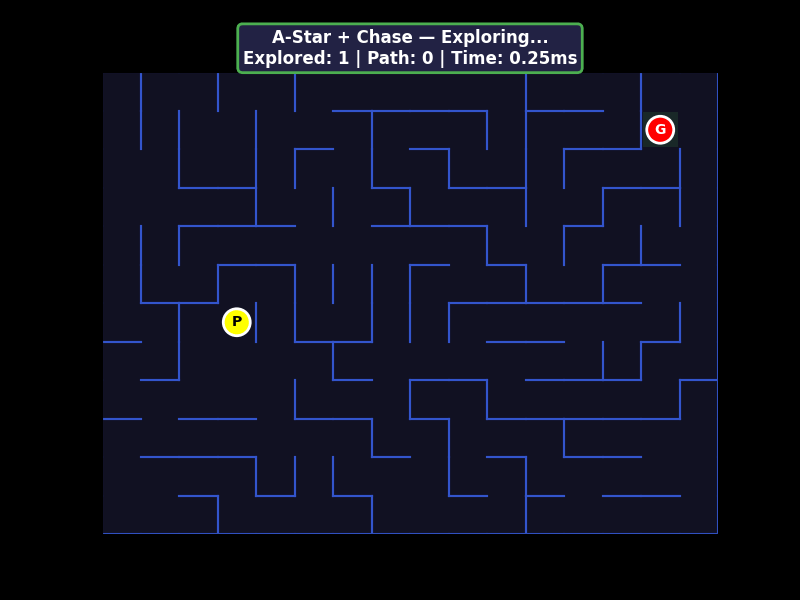 | 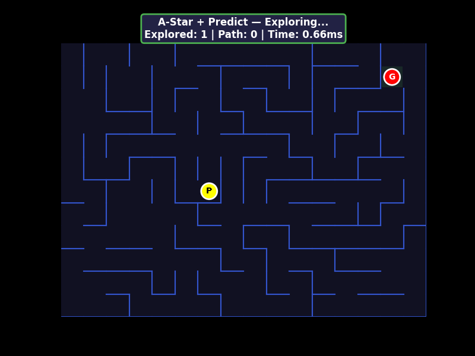 | 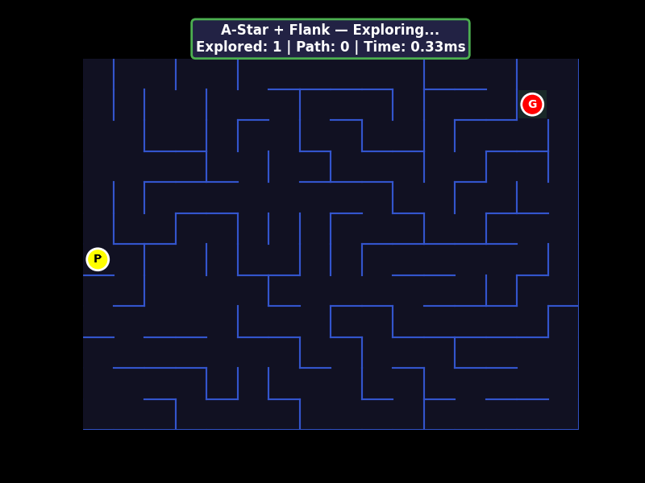 | 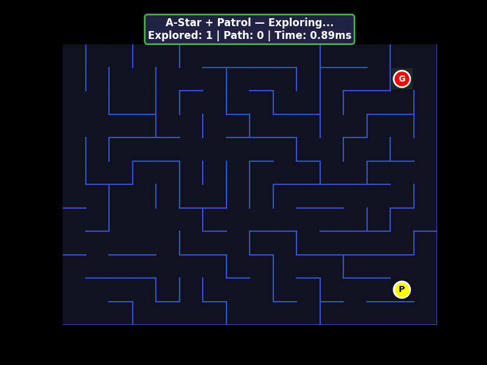 | 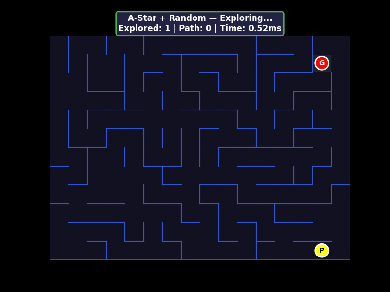 |

</details>

<details>
<summary><b>🟣 GBFS</b> — Nhanh nhất, đường có thể vòng</summary>

| Chase | Predict | Flank | Patrol | Random |
|:-----:|:-------:|:-----:|:------:|:------:|
| 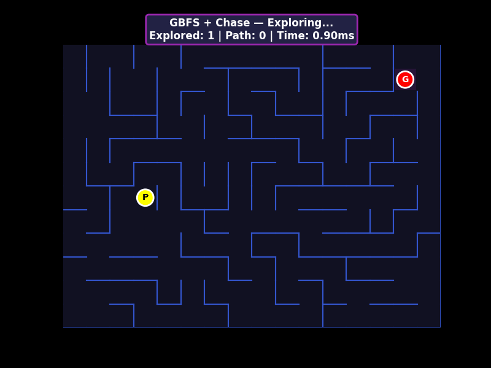 | 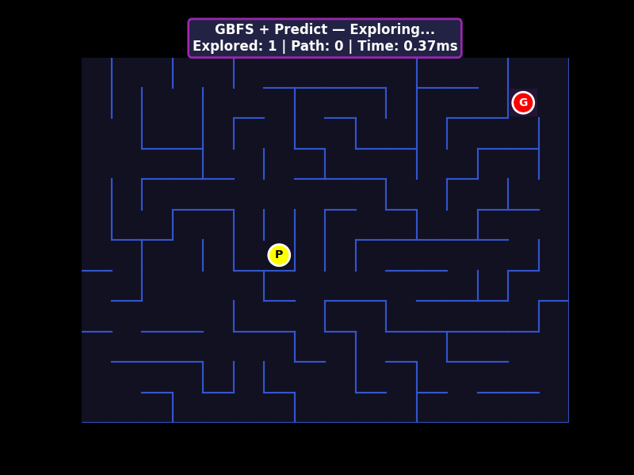 | 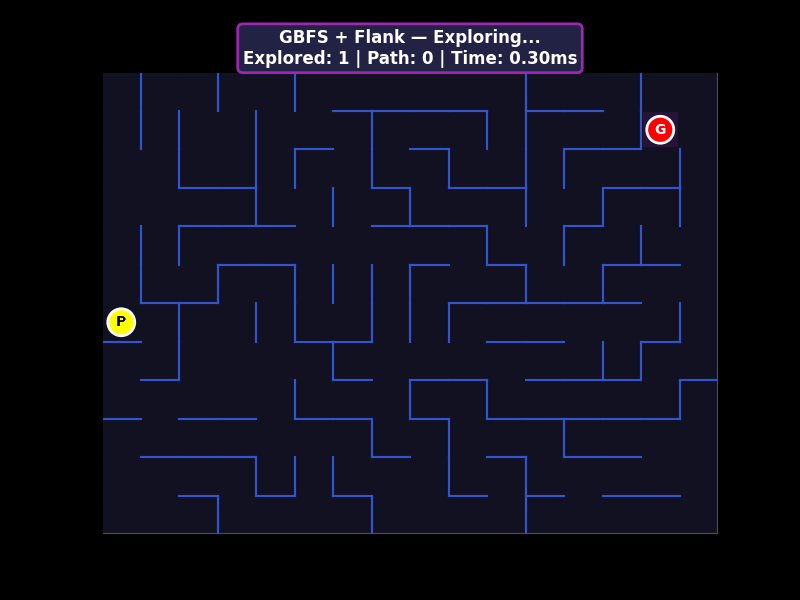 | 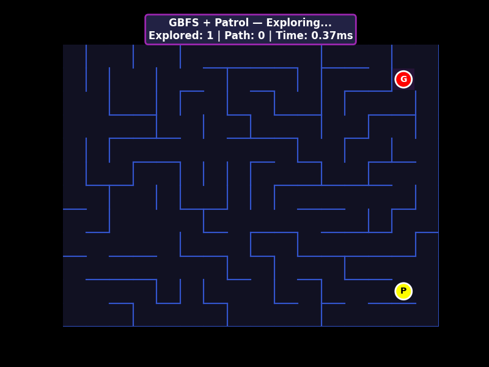 | 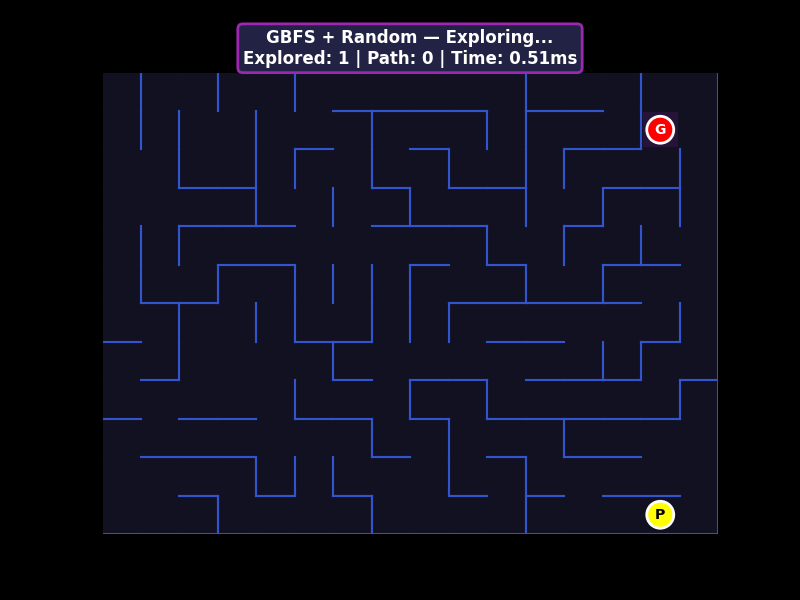 |

</details>

<details>
<summary><b>🟠 Dijkstra</b> — Đường ngắn nhất theo chi phí</summary>

| Chase | Predict | Flank | Patrol | Random |
|:-----:|:-------:|:-----:|:------:|:------:|
| 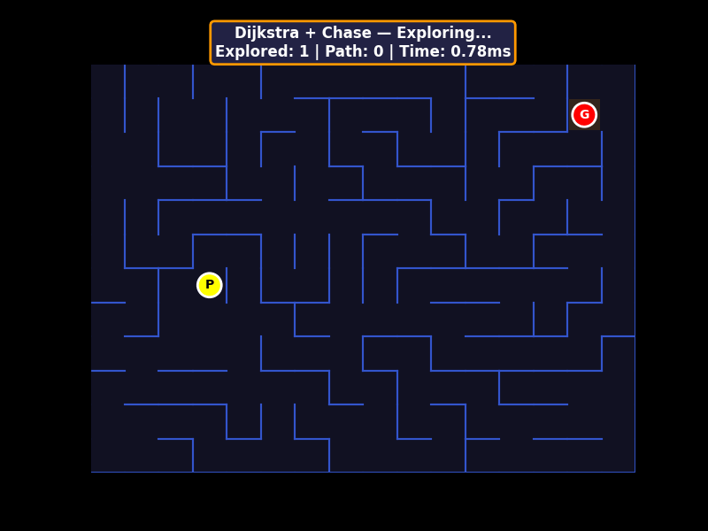 | 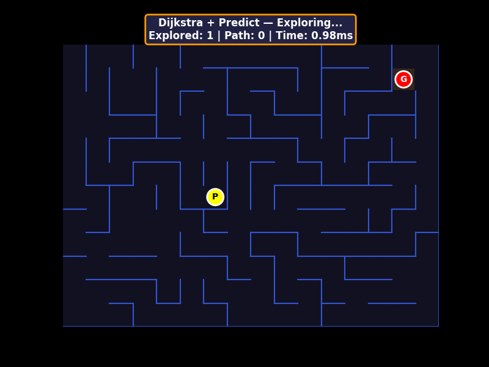 | 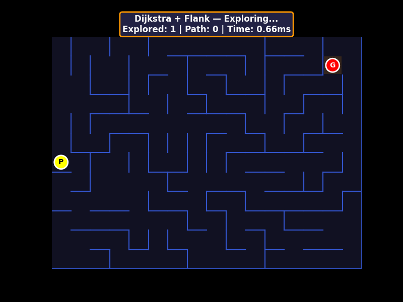 | 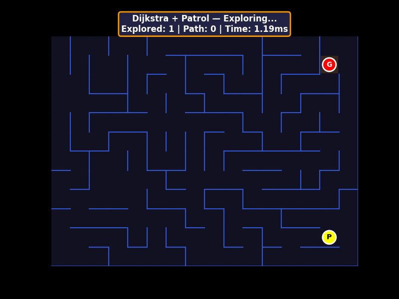 | 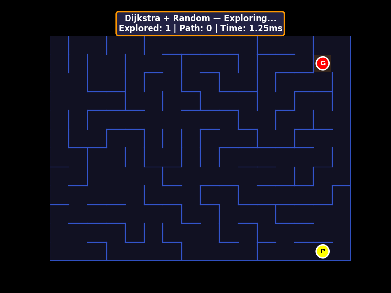 |

</details>

> 📊 Xem phân tích trực quan chi tiết (số ô duyệt, độ dài đường) trong [`algorithm_comparison.ipynb`](algorithm_comparison.ipynb).

---

## 🎯 Đề xuất cấu hình Ghost

| Ghost | Thuật toán | Hành vi | Lý do |
|:------|:-----------|:--------|:------|
| 🔴 **Blinky** | A\* | Chase | Đuổi tối ưu, luôn tìm đường ngắn nhất |
| 🩷 **Pinky** | GBFS | Predict | Phản hồi nhanh để chặn đầu Pacman |
| 🩵 **Inky** | BFS | Flank | Đường ngắn nhất để đánh sau lưng |
| 🟠 **Clyde** | Dijkstra | Patrol | Tuần tra ổn định 4 góc bản đồ |

---

## 📁 Cấu trúc dự án

```
maze_solver/
├── src/
│   ├── main.py           # Game loop, UI, event handling
│   ├── cell.py           # Ghost AI, Pacman, Cell classes
│   ├── config.py         # Hằng số cấu hình
│   ├── utils.py          # Hàm tiện ích mê cung
│   └── search/           # Thuật toán tìm đường (visualization)
│       ├── bfs.py
│       ├── dfs.py
│       ├── gbfs.py
│       └── dijkstra.py
├── demos/                # 21 GIF demo (cùng 1 mê cung)
│   ├── maze_generation/
│   ├── BFS/              # Chase / Predict / Flank / Patrol / Random
│   ├── A-Star/
│   ├── GBFS/
│   └── Dijkstra/
├── images/logo.png
├── algorithm_comparison.ipynb   # Notebook phân tích
├── generate_demos.py            # Script tạo GIF
└── README.md
```

---

## 🛠️ Công nghệ

`Python 3` · `Pygame` · `Matplotlib` · `NumPy` · `Jupyter Notebook`
# PACMAN KEY HUNT — AI Edition

Game Pacman kết hợp mê cung ngẫu nhiên và trí tuệ nhân tạo. Ghost sử dụng các thuật toán tìm đường AI để truy đuổi người chơi.

> **Môn học:** Nhập môn Trí tuệ nhân tạo — Đại học Bách Khoa Hà Nội

## Luật chơi

- Điều khiển **Pacman** bằng phím mũi tên
- Thu thập **3 chìa khóa** (Vàng, Xanh, Đỏ) rải trong mê cung
- Đến **cửa EXIT** (góc dưới-phải) sau khi có đủ chìa khóa để chiến thắng
- Tránh bị **Ghost** bắt — Ghost dùng AI tìm đường đuổi theo bạn

## Tính năng

- Mê cung ngẫu nhiên mỗi lần chơi (DFS generation + phá tường tạo nhiều đường đi)
- Tùy chỉnh kích thước bản đồ (8–28 × 6–18) và số ghost (1–4)
- Cấu hình AI cho từng ghost riêng biệt:
  - **4 thuật toán tìm đường**: BFS, A\*, GBFS, Dijkstra
  - **5 hành vi**: Chase, Predict, Flank, Patrol, Random
  - **Tốc độ**: 5–40 (tùy chỉnh mỗi ghost)
- 20 tổ hợp AI khác nhau (4 thuật toán × 5 hành vi)

---

## Demo — Tạo mê cung


> Mê cung được tạo bằng **Randomized DFS** (Recursive Backtracking), sau đó phá thêm 15% tường để tạo nhiều đường đi.

---

## Demo — So sánh thuật toán × hành vi

Tất cả các GIF demo bên dưới sử dụng **cùng một mê cung** (seed cố định) để dễ dàng so sánh sự khác biệt giữa các thuật toán và hành vi.

### BFS (Breadth-First Search)

| Chase | Predict | Flank | Patrol | Random |
|:-----:|:-------:|:-----:|:------:|:------:|
|  |  |  |  |  |

### A\* (A-Star Search)

| Chase | Predict | Flank | Patrol | Random |
|:-----:|:-------:|:-----:|:------:|:------:|
|  |  |  |  |  |

### GBFS (Greedy Best-First Search)

| Chase | Predict | Flank | Patrol | Random |
|:-----:|:-------:|:-----:|:------:|:------:|
|  |  |  |  |  |

### Dijkstra

| Chase | Predict | Flank | Patrol | Random |
|:-----:|:-------:|:-----:|:------:|:------:|
|  |  |  |  |  |

---

## Thuật toán AI áp dụng

### Thuật toán tìm đường (Pathfinding)

| Thuật toán | Tối ưu? | Mô tả |
|:-----------|:-------:|:------|
| **BFS** (Breadth-First Search) | ✅ | Duyệt theo chiều rộng, tìm đường ngắn nhất |
| **A\*** (A-Star Search) | ✅ | Kết hợp chi phí thực g(n) + heuristic h(n), hiệu quả nhất |
| **GBFS** (Greedy Best-First Search) | ❌ | Chỉ dùng heuristic h(n), phản hồi nhanh nhưng không tối ưu |
| **Dijkstra** | ✅ | Tìm đường ngắn nhất theo chi phí tăng dần, không dùng heuristic |

### Hành vi Ghost (Behavior)

| Hành vi | Ghost gốc | Mô tả |
|:--------|:---------:|:------|
| **Chase** | Blinky 🔴 | Đuổi thẳng đến vị trí hiện tại của Pacman |
| **Predict** | Pinky 🩷 | Nhắm 2 ô phía trước theo hướng Pacman đang đi |
| **Flank** | Inky 🩵 | Chặn 3 ô phía sau Pacman, tạo thế gọng kìm |
| **Patrol** | Clyde 🟠 | Tuần tra 4 góc bản đồ theo vòng lặp |
| **Random** | — | Di chuyển ngẫu nhiên, 70% giữ hướng cũ |

### Kết hợp đề xuất cho 4 Ghost

| Ghost | Thuật toán | Hành vi | Lý do |
|:------|:-----------|:--------|:------|
| 🔴 **Blinky** | A\* | Chase | Đuổi tối ưu, luôn tìm đường ngắn nhất |
| 🩷 **Pinky** | GBFS | Predict | Phản hồi nhanh, chặn đầu Pacman |
| 🩵 **Inky** | BFS | Flank | Tìm đường ngắn nhất, chặn sau lưng |
| 🟠 **Clyde** | Dijkstra | Patrol | Tuần tra ổn định các góc bản đồ |

### Tạo mê cung (Maze Generation)

- **DFS** (Randomized Depth-First Search / Recursive Backtracking): Tạo mê cung cơ bản đảm bảo mọi ô đều liên thông
- **Extra Path Removal**: Phá thêm 15% tường để tạo nhiều đường đi thay thế

---

## Cài đặt

1. Clone repository:

```bash
git clone https://github.com/Sper-il/Pacman-v2.git
cd Pacman-v2
```

2. Cài đặt thư viện:

```bash
pip install pygame matplotlib numpy
```

## Cách sử dụng

### Chạy game

```bash
python src/main.py
```

### Điều khiển

- **Phím mũi tên**: Di chuyển Pacman
- **Menu**: Chỉnh Map Size, số Ghost, nhấn PLAY GAME
- **Ghost Settings**: Chỉnh Speed / Algorithm / Behavior cho từng ghost

### Tạo lại GIF demo

```bash
python generate_demos.py
```

> Tạo 21 GIF (1 maze generation + 4 thuật toán × 5 hành vi) vào thư mục `demos/`.

### Notebook phân tích

Mở `algorithm_comparison.ipynb` trong Jupyter để xem so sánh chi tiết 4 thuật toán × 5 hành vi với biểu đồ trực quan.

---

## Cấu trúc dự án

```
maze_solver/
├── src/
│   ├── main.py           # Game loop, UI, event handling
│   ├── cell.py           # Ghost AI, Pacman, Cell classes
│   ├── config.py         # Hằng số cấu hình
│   ├── utils.py          # Hàm tiện ích mê cung
│   └── search/           # Thuật toán tìm đường (visualization)
│       ├── bfs.py
│       ├── dfs.py
│       ├── gbfs.py
│       └── dijkstra.py
├── images/
│   └── logo.png
├── demos/                # 21 GIF demo (cùng 1 mê cung)
│   ├── maze_generation/  — maze_generation.gif
│   ├── BFS/              — Chase / Predict / Flank / Patrol / Random .gif
│   ├── A-Star/           — Chase / Predict / Flank / Patrol / Random .gif
│   ├── GBFS/             — Chase / Predict / Flank / Patrol / Random .gif
│   └── Dijkstra/         — Chase / Predict / Flank / Patrol / Random .gif
├── generate_demos.py     # Script tạo GIF demo
├── algorithm_comparison.ipynb  # Notebook so sánh thuật toán
├── .gitignore
└── README.md
```

## Công nghệ sử dụng

- **Python 3.x**
- **Pygame** — Game engine
- **Matplotlib** — Visualization & GIF generation
- **Jupyter Notebook** — Phân tích và so sánh thuật toán
- **NumPy** — Xử lý ma trận mê cung